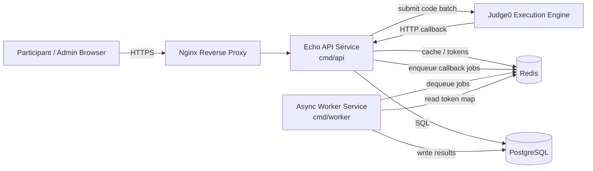
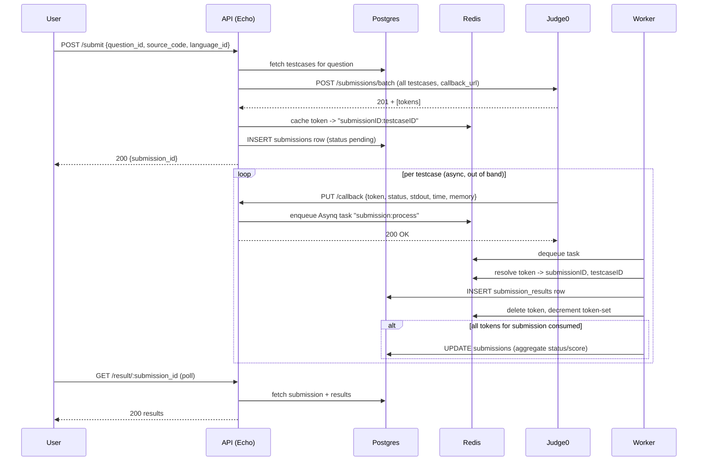
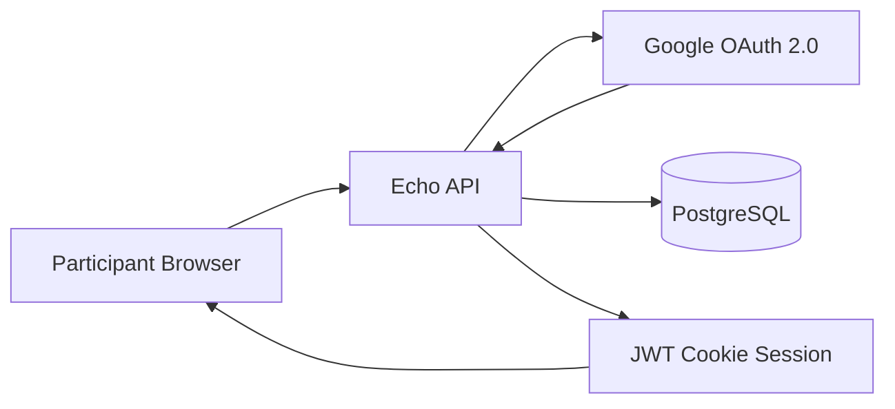
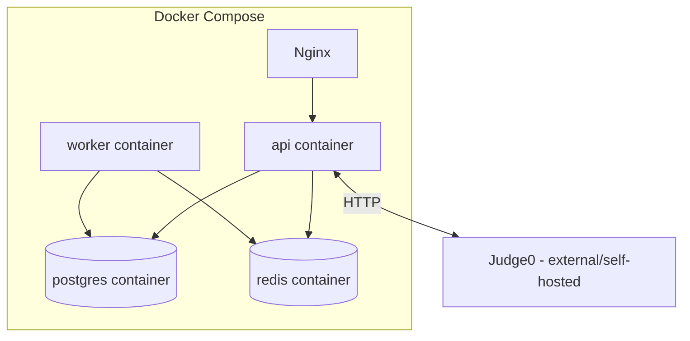

# CookOff 11 Backend — Design Document

PADH LENA PLS

test pipeline

---

# Part 1 — High-Level Design (HLD)

## 1.1 Purpose

The system manages the end-to-end lifecycle of a coding contest:

- User authentication through Google OAuth (participants, admins)
- Question and testcase management
- Code submission and asynchronous judging via **Judge0**
- Round timers and round-gated access
- Leaderboard and analytics
- Admin controls (ban/unban, round upgrades)
- **Round 1 — Scratch/visual round**: a block-based ("Scratch"-style) question format, distinct from the Judge0 code path, where users assemble `visual_blocks` into a solution and spend/earn in-contest currency (`users.balance`) via each question's `buy_in`/`reward`

## 1.2 Tech Stack

| Layer                   | Technology                                                   |
| ----------------------- | ------------------------------------------------------------ |
| Language                | Go                                                           |
| HTTP framework          | [Echo v4](https://echo.labstack.com)                         |
| Primary datastore       | PostgreSQL                                                   |
| Cache / ephemeral store | Redis                                                        |
| Async job queue         | [Asynq](https://github.com/hibiken/asynq) (Redis-backed)     |
| Code execution          | Judge0 (external self-hosted service)                        |
| DB access               | SQLC (type-safe generated queries) + `pgx/v5` driver         |
| Migrations              | Goose                                                        |
| Auth                    | Google OAuth 2.0 + JWT (access + refresh tokens via cookies) |
| Containerization        | Docker / docker-compose, Nginx reverse proxy                 |

## 1.3 System Context

The system is split into **two deployable Go binaries** sharing the same codebase:

1. **API service** (`cmd/api`) — stateless HTTP server, handles all REST endpoints, and enqueues Judge0 callback events.
2. **Worker service** (`cmd/worker`) — Asynq consumer that processes Judge0 callback events off Redis and persists results to Postgres.

This decouples the latency-sensitive HTTP path from the (potentially bursty) job of writing per-testcase results, allowing independent scaling of API replicas vs worker concurrency (`WORKER_COUNT` env var).

## 1.4 Major Components

| Component                           | Responsibility                                                                   |
| ----------------------------------- | -------------------------------------------------------------------------------- |
| **Router** (`pkg/router`)           | Declares route groups: public, authenticated, admin-only, question, testcase     |
| **Middlewares** (`pkg/middlewares`) | JWT verification, ban check, admin-only gate, global rate limiting               |
| **Controllers** (`pkg/controllers`) | Request handlers — one file per resource/feature                                 |
| **Helpers** (`pkg/helpers`)         | Auth (JWT/bcrypt), submission-building logic, validation, caches, timers, config |
| **DTOs** (`pkg/dto`)                | Request/response and Judge0 payload shapes                                       |
| **DB layer** (`pkg/db`)             | SQLC-generated queries and models                                                |
| **Queue** (`pkg/queue`)             | Asynq client/server bootstrap                                                    |
| **Workers** (`pkg/workers`)         | Asynq task handlers (Judge0 callback processing)                                 |
| **Database** (`database/`)          | Goose migrations (schema) + SQL query definitions consumed by SQLC               |

## 1.5 Key Architectural Flow — Code Submission

This is the most complex flow in the system and is worth calling out at HLD level:

**Why this design:** Judge0 executes each testcase asynchronously and calls back per testcase. Rather than blocking the HTTP request thread on all testcases completing, the API immediately returns a `submission_id`, and a Redis Set (`sub:<id>:tokens`) tracks outstanding Judge0 tokens. The worker decrements this set on each callback and only finalizes/aggregates the submission once every token has resolved — a fan-out/fan-in pattern.

## 1.6 Non-Functional Characteristics

- **Statelessness**: API pods don't hold session state — JWT access/refresh tokens (cookie-based) carry identity; horizontally scalable behind Nginx.
- **Ban / access gating**: `BanCheckUser` and round-qualification checks (`VerifyRoundAccess`) enforce contest fairness before allowing submissions.
- **Decoupled execution**: Judge0 is a separate, independently scaled execution sandbox; the Go backend never executes untrusted user code itself.
- **Config**: fully env-driven (`pkg/helpers/helpers/util/config.go`), validated with required fields at boot (fails fast if misconfigured).
- **Observability**: centralized Zap-based structured logging with environment-specific encoders and HTTP route attributes (method, uri, status, latency, ip, error).

## 1.6.1 Authentication Architecture — Google OAuth

Google OAuth is an external identity provider integrated into the existing stateless JWT architecture.

The backend remains the source of truth for application identity, roles, bans, round qualification, balance, score, and contest permissions. Google is used only to authenticate and verify the external identity. Authorization remains entirely inside the backend.

## 1.7 Deployment View

Services declared in `docker-compose.yml`: `postgres`, `redis`, `api` (built from `Dockerfile`), `worker` (built from `Dockerfile.worker`), and `nginx` as reverse proxy in front of the API.

---
