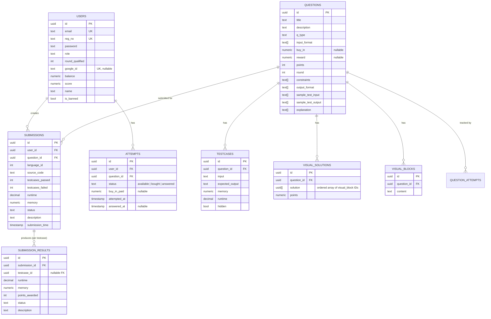
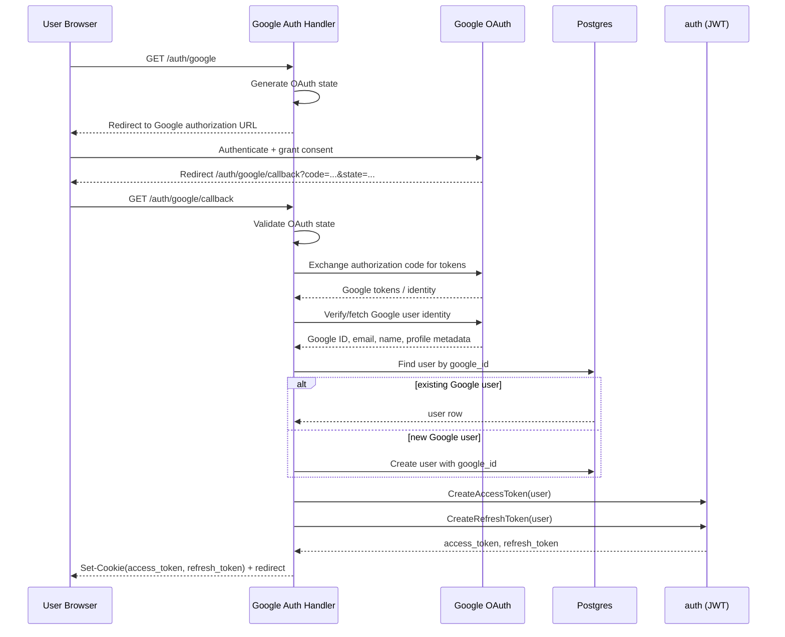
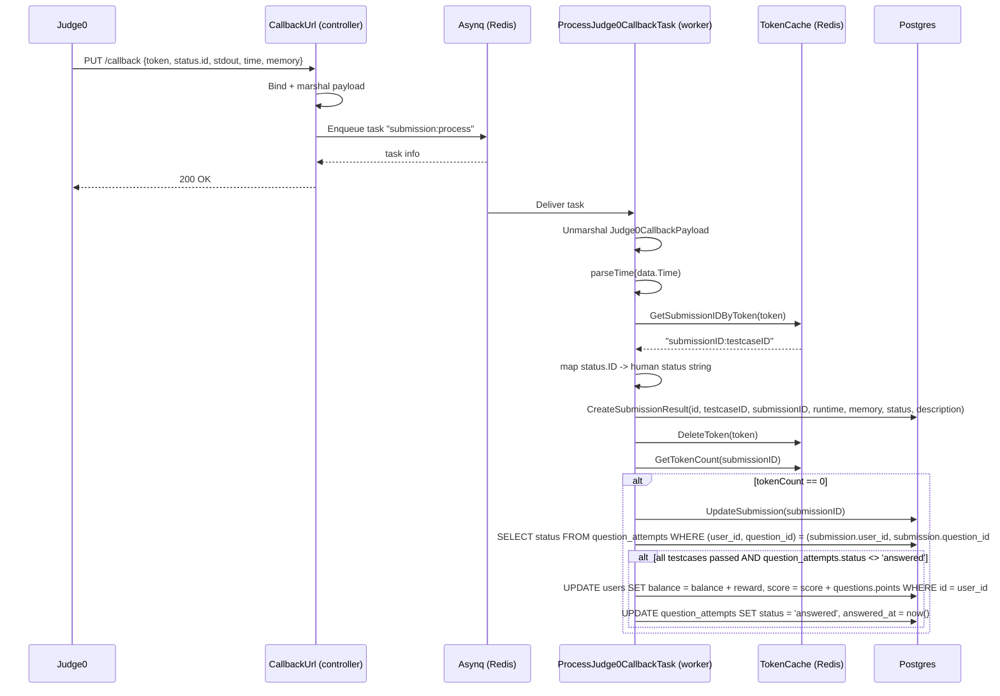
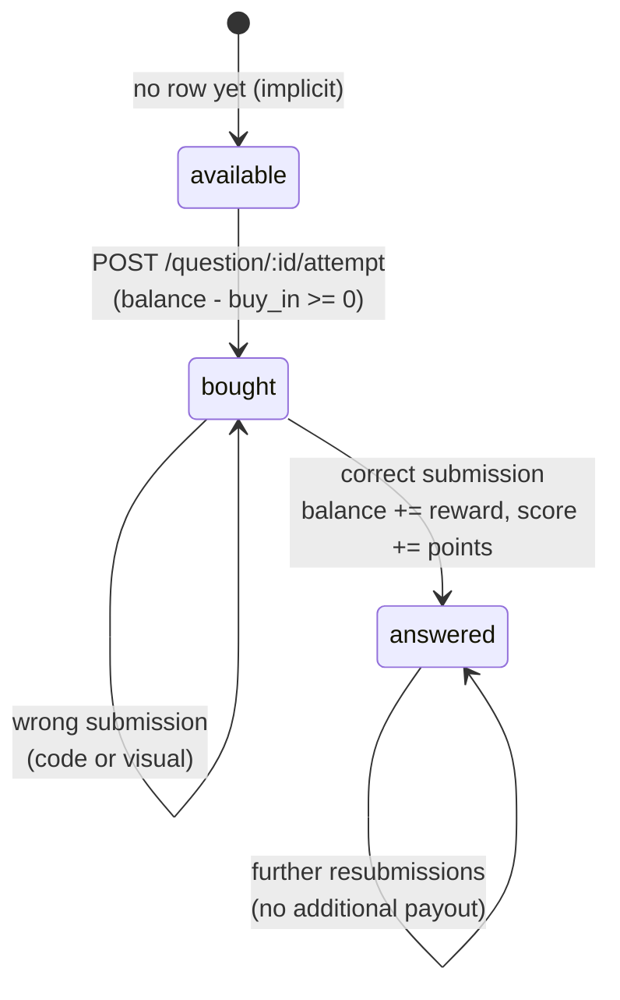
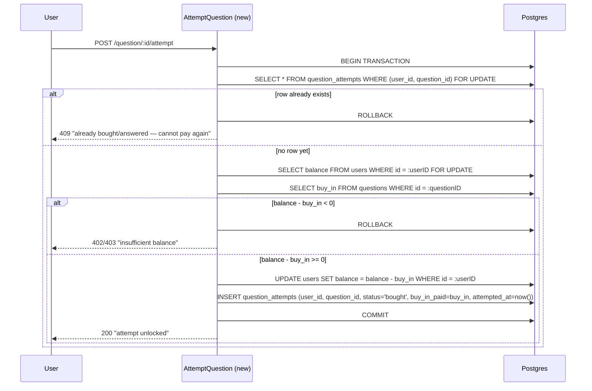
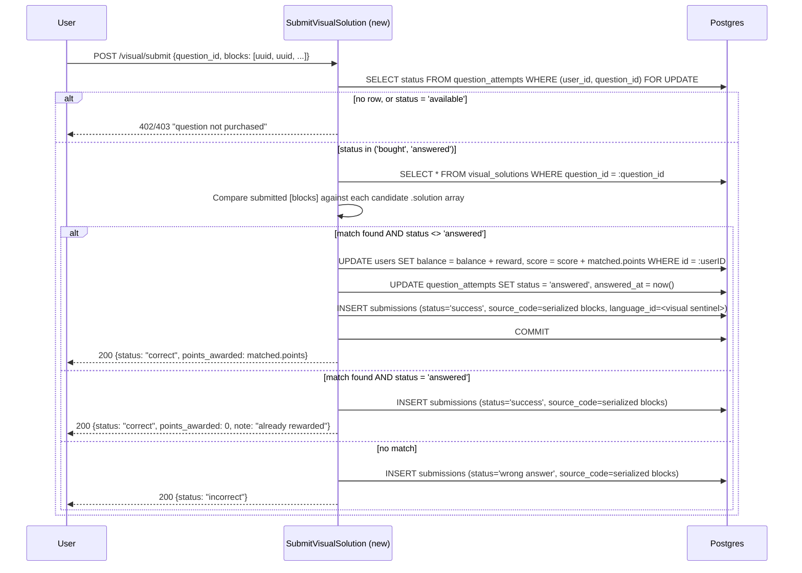
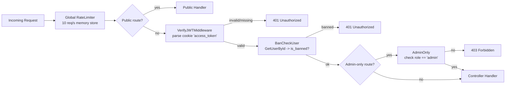
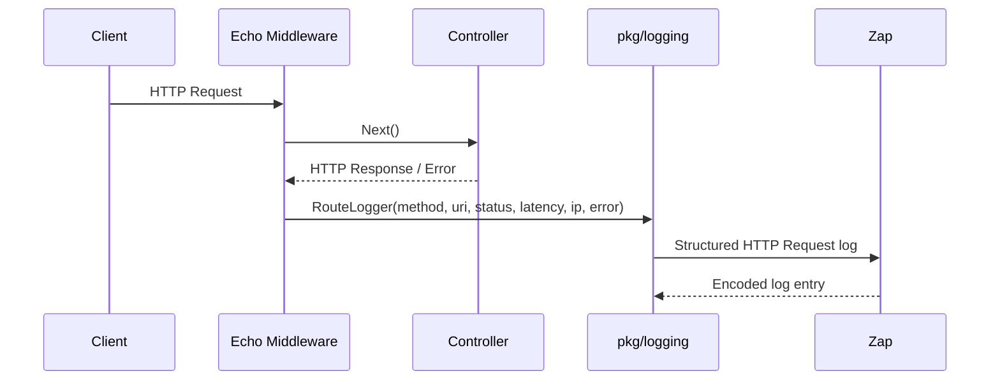

# Low-Level Design (LLD)

## 2.1 Package / Module Map

```
cmd/
  api/main.go        - HTTP server bootstrap (Echo, routes, queue client)
  worker/main.go      - Asynq worker bootstrap (mux -> ProcessJudge0CallbackTask)
internal/
  router/              - route registration, grouped by domain
  middlewares/          - VerifyJWTMiddleware, BanCheckUser, AdminOnly
  controllers/           - one handler file per resource
  helpers/
    auth/                - JWT create/parse, bcrypt password gen
    submission/           - Judge0 payload building, batch submission, result parsing
    utils/                - config, DB init, Redis caches, timer, constants, numeric helpers
    validator/             - go-playground validator wiring
  dto/                    - request/response/Judge0 payload structs
  db/                     - SQLC-generated models + query interfaces
  queue/                   - Asynq client/server init
  workers/                  - Asynq task handler(s)
database/
  schema/                    - Goose SQL migrations (001..010)
  queries/                    - SQL consumed by SQLC to generate pkg/db
```

## 2.2 Routing Table

Root-level middleware: global rate limiter (10 req/s) → public routes → `api` group (`VerifyJWTMiddleware` → `BanCheckUser`) → domain sub-routers.

| Method | Path | Auth | Handler |
|---|---|---|---|
| GET | `/ping` | none | `Ping` |
| PUT | `/callback` | none (Judge0 → server) | `CallbackUrl` |
| GET | `/docs` | none | `Docs` |
| POST | `/signup` | none | `Signup` |
| POST | `/login` | none | `Login` |
| POST | `/refreshToken` | none | `RefreshToken` |
| POST | `/logout` | JWT | `Logout` |
| POST | `/submit` | JWT + ban check | `SubmitCode` |
| POST | `/runcode` | JWT + ban check | `RunCode` |
| POST | `/runcustom` | JWT + ban check | `RunCustom` |
| GET | `/result/:submission_id` | JWT + ban check | `GetResult` |
| GET | `/dashboard` | JWT + ban check | `LoadDashboard` |
| GET | `/getTime` | JWT + ban check | `GetTime` |
| GET | `/question/round` | JWT + ban check | `GetQuestionsByRound` |
| GET/POST/PUT/DELETE | `/question[/:id]` | JWT + Admin + ban check | question CRUD |
| POST | `/question/:id/bounty/activate` \| `/deactivate` | JWT + Admin | bounty toggles |
| GET | `/testcase/:id`, `/testcase` | JWT + ban check | testcase reads |
| GET | `/question/:id/testcases[/public]` | JWT + ban check | testcase-by-question reads |
| POST/PUT/DELETE | `/testcase[/:id]` | JWT + Admin | testcase CRUD |
| GET | `/admin/users` | JWT + Admin | `GetAllUsers` |
| POST | `/admin/users/:id/ban` \| `/unban` \| `/upgrade` | JWT + Admin | user moderation |
| GET | `/admin/users/:id/submissions` | JWT + Admin | `GetUserSubmissions` |
| GET | `/admin/leaderboard` | JWT + Admin | `GetLeaderboard` |
| GET | `/admin/analytics` | JWT + Admin | `GetAnalytics` |
| POST | `/admin/setTime` \| `/updateTime` | JWT + Admin | round timer config |
| GET | `/admin/startRound` \| `/resetRound` | JWT + Admin | round control |

> **Middleware order matters**: for `BanCheckUser` to work it must run *after* `VerifyJWTMiddleware` sets the user ID in Echo's context — this ordering constraint is explicitly commented in the source.

## 2.3 Data Model (ERD)




## 2.1 Redis Key Design

| Key pattern | Type | Purpose | Set by | Consumed / cleared by |
|---|---|---|---|---|
| `token:<judge0_token>` | string | Maps a Judge0 token → `"submissionID:testcaseID"` | `SubmitCode` | `ProcessJudge0CallbackTask` (read then `DeleteToken`) |
| `sub:<submissionID>:tokens` | set | Tracks outstanding Judge0 tokens for a submission | `SubmitCode` (SAdd) | Worker decrements via `GetTokenCount`; triggers final `UpdateSubmission` at 0 |
| access/refresh tokens | JWT (stateless, cookie) | Auth | `auth.CreateAccessToken` / `CreateRefreshToken` | `VerifyJWTMiddleware` |

`pkg/helpers/utils/tokenCache.go` centralizes the Redis client used purely for the Judge0 token↔submission map (`TokenCache`), separate from the general `RedisClient` used for other caching.

## 2.2 Authentication and Authorization

The backend uses Google OAuth 2.0 as the only authentication mechanism.

There is no email/password authentication flow. Google is responsible for authenticating the user, while the CookOff backend is responsible for creating/identifying the application user and issuing its own JWT-based session after successful OAuth authentication.

The resulting application session uses the existing access/refresh JWT cookies, so all protected routes continue to use VerifyJWTMiddleware.

### 2.2.1 Google OAuth 2.0 Flow

The backend uses the OAuth 2.0 authorization-code flow. The browser is redirected to Google, Google authenticates the user, and Google redirects the browser back to the backend callback endpoint.


### 2.2.2 User Identity Model

Google's stable user identifier is stored in users.google_id.

users
 ├── id              UUID PK
 ├── email           TEXT UNIQUE
 ├── google_id       TEXT UNIQUE
 ├── role            TEXT
 ├── round_qualified INT
 └── ...

A CookOff account is therefore created through Google OAuth. The backend must not store a Google password or Google OAuth access token as the user's application password.

The google_id is the primary external identity used to associate a Google account with a CookOff user.

### 2.2.3 OAuth Security Requirements

The Google OAuth implementation must:

- generate and validate an OAuth state value to prevent CSRF;

- keep the Google client ID/secret server-side in environment configuration;

- use the configured redirect URI;

- verify the Google identity returned by the provider before creating the application user;

- use Google's stable user ID as google_id;

- never trust client-supplied Google identity information;

- issue the application's JWT cookies only after successful Google authentication;

- never expose Google client secrets or authorization codes to the frontend.

Here’s the cleaned-up Markdown with consistent headings, tables, Mermaid syntax, spacing, and code fences. I kept the content unchanged.

## 2.5.4 Authentication Endpoints

| Method | Path                    | Auth | Purpose                                                                             |
| ------ | ----------------------- | ---- | ----------------------------------------------------------------------------------- |
| GET    | `/auth/google`          | None | Start Google OAuth authorization                                                    |
| GET    | `/auth/google/callback` | None | Handle Google's OAuth callback, create/find the user, and establish the JWT session |
| POST   | `/refreshToken`         | None | Refresh the application's access token                                              |
| POST   | `/logout`               | JWT  | Clear application authentication cookies                                            |

There are no `/signup` or `/login` email/password endpoints because Google OAuth is the sole authentication method.

### 2.5.5 Authorization After OAuth

OAuth authenticates the user; it does not determine contest permissions.

After the backend identifies the Google user, the normal application authorization chain applies:

```text
Google OAuth
    ↓
Find/Create CookOff User
    ↓
Issue JWT Access + Refresh Cookies
    ↓
VerifyJWTMiddleware
    ↓
BanCheckUser
    ↓
AdminOnly / Round Qualification
    ↓
Controller
```

Roles, bans, round qualification, balances, scores, submissions, and all other contest state remain controlled by the CookOff backend.

## 2.6 Sequence — Judge0 Callback → Result Persistence (Detailed)



**Judge0 status-code mapping** (`pkg/workers/submission.go`):

| Judge0 status.id | Mapped status                                |
| ---------------: | -------------------------------------------- |
|                1 | In Queue                                     |
|                2 | Processing                                   |
|                3 | success                                      |
|                4 | wrong answer                                 |
|                5 | Time Limit Exceeded                          |
|                6 | Compilation error                            |
|             7–12 | Runtime error (various runtime signal codes) |
|               13 | Internal Error                               |
|               14 | Exec Format Error                            |

> **Balance/reward now applies uniformly to both rounds.** The `attempts.status` gate makes this safe for repeated (re-)submissions on the code round: a user can resubmit a solved question as many times as they like (e.g. to improve runtime), but `balance += reward` and `score += points` only fire the first time `status` transitions into `'answered'`. The `FOR UPDATE` lock plus the `status <> 'answered'` check makes this idempotent even if two finalization paths race.

## 2.7 Sequence — Code Submission (Controller-Level Detail)

`controllers.SubmitCode`:

1. Bind `dto.SubmissionRequest` (`question_id`, `language_id`, `source_code`).
2. Read `userID` from the Echo context (set by JWT middleware).
3. Parse `question_id` → UUID; return `400` on failure.
4. `auth.VerifyRoundAccess(ctx, userID, questionID)` checks the user's `round_qualified` against the question's `round`; return `403` if not qualified.
5. **(New)** Look up `question_attempts` for `(userID, questionID)`:

   * No row, or `status = 'available'` → the question hasn't been bought yet → **402/403** `"question not purchased — call /question/:id/attempt first"`.
   * Alternatively, some teams may choose to auto-charge `buy_in` inline here instead of requiring a separate `/attempt` call. Either way, the balance check in §2.8.3 applies.
   * `status = 'bought'` or `status = 'answered'` → proceed. An already-`answered` question can still be resubmitted for practice; it just won't pay out again, per §2.6.
6. Generate a fresh `submissionID` (`uuid.New()`).
7. Fetch all the test cases and generate a payload with `CreateSubmissionPayload(sourceCode string, languageID int, testCases []db.TestCase)`:

   * Computes a language-specific runtime multiplier (`RuntimeMut`).
   * Base64-encodes source/stdin/expected-output per Judge0's batch API contract.
   * Builds a `Judge0Submission` per testcase, each carrying the shared `CallbackURL`.
8. POST the batch payload to `Judge0URI/submissions/batch?base64_encoded=true` via `submissions.SendSubmissionPayload`.
9. On `201 Created`, decode the returned `[]Token`.
10. For each token:

    * Cache `token:<token> -> "<submissionID>:<testcaseID>"`.
    * Add the token to the `sub:<submissionID>:tokens` Redis set.
11. Persist the submission row (`CreateSubmission` SQLC query) with the initial/default status.
12. Respond `200 {submission_id}` to the client immediately. Result population (and the reward/status hook) happens asynchronously per §2.6.

## 2.8 Round 1 — Scratch/Visual Question Flow (New)

### 2.8.1 Business Rules (as Specified)

1. Round 1 questions (`questions.round = 1`, `q_type = 'visual'` or similar) are solved by arranging `visual_blocks` rather than submitting source code to Judge0.
2. A question can have **multiple valid solutions** — each stored as a separate row in `visual_solutions`, with its own ordered `solution UUID[]` (a sequence of `visual_blocks.id`) and its own `points` value.
3. To **attempt** a question, a player must spend its `buy_in`. This is allowed only if `balance - buy_in >= 0`.
4. **A question cannot be paid for twice.** `question_attempts.status` enforces this: once a row exists with `status IN ('bought', 'answered')`, a second `/attempt` call for the same `(user, question)` is rejected rather than deducting `buy_in` again.
5. **The buy-in/reward economy applies to both rounds, not just the visual one.** The same `question_attempts` row and `status` field gate the code-submission path too (§2.6, §2.7). A Round 2+ code question also requires `status IN ('bought', 'answered')` before `/submit` is allowed, and only pays `reward`/`points` once.
6. On a **correct** submission — code (Judge0, all testcases pass) or visual (block sequence matches a `visual_solutions` row) — `status` transitions to `'answered'`, `balance += reward`, and score increases (`questions.points` for code, the matched row's `points` for visual). This transition, and therefore the payout, happens **at most once** per `(user, question)`, regardless of how many times the user resubmits afterward.
7. On an **incorrect** submission, `status` stays `'bought'` (not `'answered'`) and the previously spent `buy_in` is not refunded (see remaining open question below).

### 2.8.2 `question_attempts.status` State Machine



`available` is the implicit state when no `question_attempts` row exists for `(user, question)` yet. A row is only ever inserted once payment succeeds, so in practice a row's status is always `'bought'` or `'answered'`.

The `available` value is still defined in the schema, rather than relying solely on row absence, in case a future requirement pre-seeds attempt rows for every user at contest start.

### 2.8.3 Proposed New Endpoints

| Method | Path                    | Auth            | Purpose                                                                                                                                                                               |
| ------ | ----------------------- | --------------- | ------------------------------------------------------------------------------------------------------------------------------------------------------------------------------------- |
| GET    | `/question/:id/blocks`  | JWT + ban check | Fetch the palette of `visual_blocks` available for a question                                                                                                                         |
| POST   | `/question/:id/attempt` | JWT + ban check | Create/gate a `question_attempts` row: deduct `buy_in`, set `status = 'bought'`. Reject if a row already exists for this `(user, question)`. Used by **both** code and visual rounds. |
| POST   | `/visual/submit`        | JWT + ban check | Submit an ordered array of block IDs; score against `visual_solutions`                                                                                                                |

### 2.8.4 Sequence — Attempt (Buy-In, Shared by Both Rounds)



The `UNIQUE(user_id, question_id)` constraint on `question_attempts` (see migration `009`) is the actual backstop against double-payment, even if the `SELECT ... FOR UPDATE` existence check is raced. A concurrent second `INSERT` will fail the unique constraint and roll back.

### 2.8.5 Sequence — Submit Visual Solution



The `status <> 'answered'` check inside the transaction, combined with the `FOR UPDATE` lock from the initial read, guarantees that a question's reward can only be collected once — even if the user resubmits the same or a different valid solution afterward.

## 2.9 Middleware Chain Detail



* `VerifyJWTMiddleware` reads the `access_token` cookie, parses/validates the JWT with `auth.AccessTokenClaims`, and sets `userID` + lowercase `role` into Echo's request context.
* `BanCheckUser` re-fetches the user row from Postgres per request to check the live `is_banned` flag. This is not cached, ensuring a ban takes effect immediately, at the cost of one DB round-trip per authenticated request.
* `AdminOnly` is purely a context-role check with no DB call. It is applied on top of the above two for `/admin/*` and admin-only question/testcase routes.

## 2.10 Logging and Observability

The backend uses a centralized `pkg/logging` package built on Uber's Zap logger. Controllers, middleware, workers, and helpers should use this package instead of direct `fmt.Printf`, `log.Printf`, or ad-hoc logging.

### 2.10.1 Logger Responsibilities

* Initialize a process-wide Zap logger at application startup.
* Use production JSON logging when `ENV=production`.
* Use development-friendly, colorized logs outside production.
* Expose convenience helpers such as `Infof`, `Warnf`, `Errorf`, `Debugf`, and `Fatalf`.
* Provide structured HTTP route logging through `RouteLogger`.
* Record method, URI, HTTP status, latency, client IP, and request error information.
* Fall back to a no-op logger if Zap initialization fails rather than crashing the application during logger setup.

### 2.10.2 Logging Package

```go
package logging

import (
    "os"
    "time"

    "github.com/labstack/echo/v4"
    "go.uber.org/zap"
    "go.uber.org/zap/zapcore"
)

var Log *zap.SugaredLogger

func InitLogger() {
    var config zap.Config

    env := os.Getenv("ENV")

    if env == "production" {
        config = zap.NewProductionConfig()
        config.EncoderConfig.TimeKey = "timestamp"
        config.EncoderConfig.EncodeTime = zapcore.ISO8601TimeEncoder
    } else {
        config = zap.NewDevelopmentConfig()
        config.EncoderConfig.EncodeLevel = zapcore.CapitalColorLevelEncoder
        config.EncoderConfig.EncodeTime = func(t time.Time, enc zapcore.PrimitiveArrayEncoder) {
            enc.AppendString(t.Format("2006-01-02 15:04:05"))
        }
    }

    logger, err := config.Build()
    if err != nil {
        Log = zap.NewNop().Sugar()
        Log.Warnf("Failed to initialize zap logger, using noop logger: %v", err)
        return
    }

    Log = logger.Sugar()
}

func Infof(template string, args ...interface{}) {
    Log.Infof(template, args...)
}

func Warnf(template string, args ...interface{}) {
    Log.Warnf(template, args...)
}

func Errorf(template string, args ...interface{}) {
    Log.Errorf(template, args...)
}

func Fatalf(template string, args ...interface{}) {
    Log.Fatalf(template, args...)
}

func Debugf(template string, args ...interface{}) {
    Log.Debugf(template, args...)
}

type MiddlewareLogValues struct {
    Method  string
    URI     string
    Status  int
    Latency time.Duration
    IP      string
    Error   error
}

func RouteLogger(c echo.Context, values MiddlewareLogValues) error {
    Log.Infow(
        "HTTP Request",
        "method", values.Method,
        "uri", values.URI,
        "status", values.Status,
        "latency", values.Latency,
        "ip", values.IP,
        "error", values.Error,
    )

    return nil
}
```

### 2.10.3 Logging Flow



### 2.10.4 Logging Guidelines

* Use structured fields for values that may be queried or aggregated.
* Do not log passwords, JWTs, Google OAuth authorization codes, Google client secrets, or other authentication credentials.
* Do not log complete source code or sensitive user data unless explicitly required for debugging and appropriately protected.
* Use `Debugf` for high-volume diagnostic information.
* Use `Infof` for normal application events.
* Use `Warnf` for recoverable abnormal conditions.
* Use `Errorf` for failed operations that require attention.
* Use `Fatalf` only for unrecoverable process-level failures.

## 2.11 Key Structs / Contracts

```go
// dto.SubmissionRequest (submitted by client)
type SubmissionRequest struct {
    QuestionID string
    LanguageID int
    SourceCode string
}

// helpers/submission.SubmissionInput (internal)
type SubmissionInput struct {
    ID         string
    QuestionID string
    LanguageID int
    SourceCode string
    UserID     string
}

// helpers/submission.Judge0Submission (sent to Judge0, per testcase)
type Judge0Submission struct {
    LanguageID int
    SourceCode string
    Stdin      string
    ExpectedOutput string
    Runtime    float64 // cpu_time_limit
    Callback   string
}

// dto.Judge0CallbackPayload (received from Judge0)
type Judge0CallbackPayload struct {
    StdOut  *string
    Time    string
    Memory  int
    StdErr  *string
    Token   string
    Message *string
    Status  struct {
        ID          int
        Description string
    }
}
```
